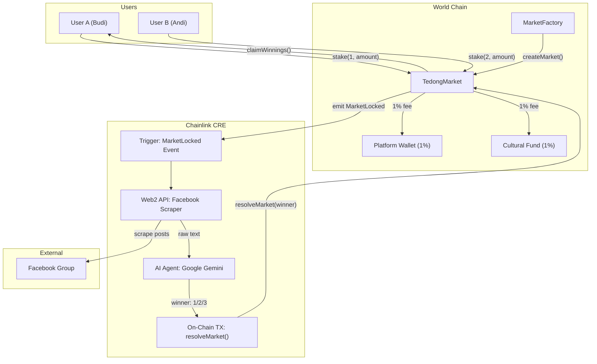
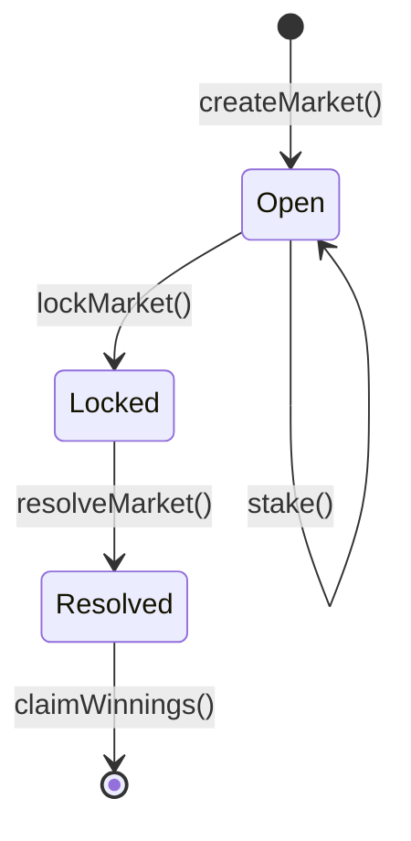

# Tedong Silaga

Decentralized prediction market for the traditional Torajan buffalo fighting ceremony (Tedong Silaga), built on World Chain with Chainlink CRE as the oracle and AI orchestration layer.

## Problem

| Problem              | Description                                                                                                                         |
| -------------------- | ----------------------------------------------------------------------------------------------------------------------------------- |
| **No Transparency**  | Traditional betting is prone to manipulation and human error. There is no verifiable record of bets or outcomes.                    |
| **Oracle Problem**   | Buffalo fight results are not available on any sports API. Results are scattered across local Facebook groups as unstructured text. |
| **Sybil Attacks**    | Without identity verification, whales can manipulate pools using thousands of bot accounts.                                         |
| **Cultural Erosion** | The Torajan buffalo fighting tradition lacks global visibility and sustainable funding for preservation.                            |

## Solution

Tedong Silaga solves these problems by combining blockchain, AI, and decentralized identity:

| Solution                  | How                                                                                                                                                                     |
| ------------------------- | ----------------------------------------------------------------------------------------------------------------------------------------------------------------------- |
| **Trustless Settlement**  | Funds are locked in smart contracts and only distributed based on verified on-chain data. No intermediary can run away with the money.                                  |
| **AI-Powered Oracle**     | Chainlink CRE Workflow scrapes Facebook group posts, sends them to an LLM (Google Gemini) for sentiment analysis, and calls `resolveMarket()` on-chain with the winner. |
| **Sybil Resistance**      | World ID ensures 1 human = 1 account. Gasless transactions via World Chain Paymaster.                                                                                   |
| **Cultural Preservation** | 1% of every winning pool is automatically sent to a multisig wallet managed by the Torajan cultural council.                                                            |

## Key Advantages

- **Fully On-Chain** — All bets, results, and payouts are recorded on World Chain
- **No Intermediary** — Smart contracts handle all fund management
- **AI Oracle** — LLM extracts results from unstructured social media data
- **Fair Fees** — Only 2% total (1% platform + 1% cultural fund)
- **Gasless UX** — World ID + Paymaster for zero-gas transactions

## System Architecture



## Market Lifecycle



| Phase        | Action                                                            | Actor         |
| ------------ | ----------------------------------------------------------------- | ------------- |
| **Open**     | Users stake tokens on Buffalo A or B                              | Users         |
| **Locked**   | Market is locked when the match starts, no more stakes            | Admin         |
| **Resolved** | CRE Workflow determines the winner via AI and calls resolveMarket | Chainlink CRE |
| **Claimed**  | Winners withdraw their proportional share of the pool             | Users         |

## Fee Distribution

| Recipient                  | Percentage | Purpose                                                     |
| -------------------------- | ---------- | ----------------------------------------------------------- |
| Platform Wallet            | 1%         | Operational costs, Chainlink CRE execution fees             |
| Cultural Preservation Fund | 1%         | Torajan cultural council multisig for heritage preservation |
| Winners                    | 98%        | Distributed proportionally based on stake amount            |

## Project Structure

```
TedongSilaga/
├── SmartContracts-TedongSilaga/   # Solidity contracts (Foundry)
│   ├── src/                        # Core contracts
│   ├── test/                       # Test suite
│   └── script/                     # Deploy scripts
├── frontend/                       # Next.js (coming soon)
├── cre-workflow/                   # Chainlink CRE config (coming soon)
└── PRD.md                          # Product Requirements Document
```

## Smart Contracts

Full smart contract documentation, function reference, and deployed addresses:

**[Smart Contracts README](./SmartContracts-TedongSilaga/README.md)**

## Tech Stack

| Layer           | Technology                                 |
| --------------- | ------------------------------------------ |
| Blockchain      | World Chain (L2)                           |
| Smart Contracts | Solidity 0.8.20, OpenZeppelin              |
| Development     | Foundry (Forge, Cast, Anvil)               |
| Oracle          | Chainlink CRE (Runtime Environment)        |
| AI              | Google Gemini LLM                          |
| Identity        | World ID (Sybil resistance)                |
| Data Source     | Facebook Group API / Scraper               |
| Token           | WLD / Mock USDC self deploy on World Chain |
