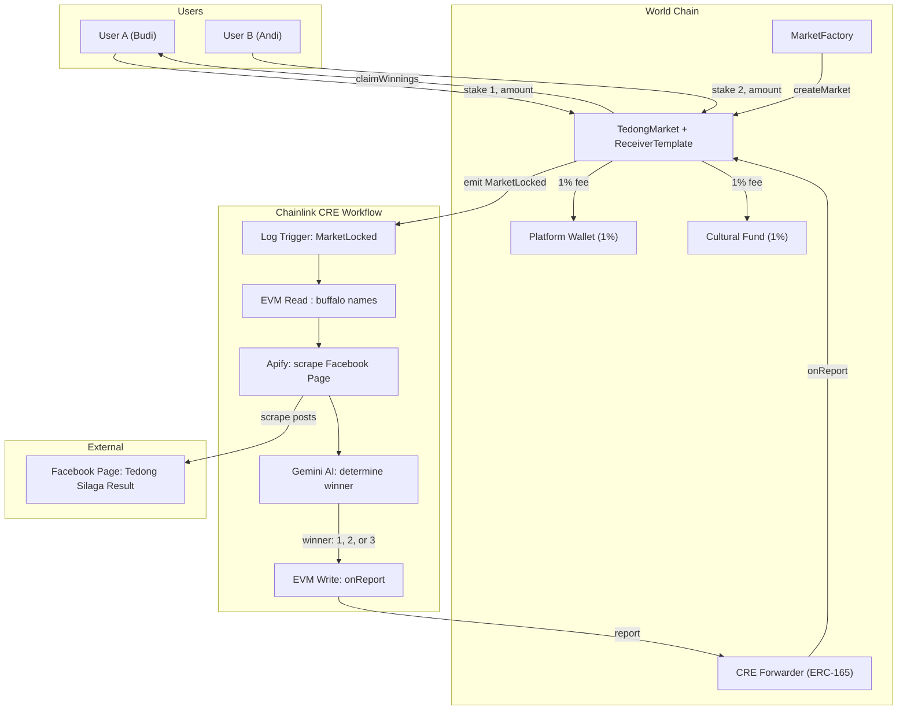
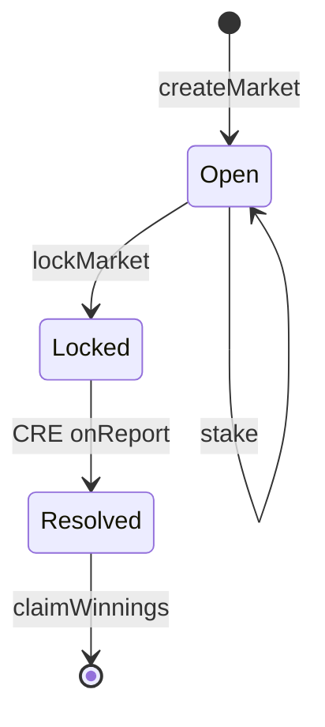

  

# Tedong Silaga

**Decentralized prediction market for traditional Torajan buffalo fighting,**
**powered by World Chain, Chainlink CRE, and Google Gemini AI.**

---

## 🐃 What is Tedong Silaga?

Deep in the highlands of **Tana Toraja, Indonesia**, lives a centuries-old tradition called **_Ma'pasilaga Tedong_** (Tedong Silaga): ritual buffalo fighting held during **Rambu Solo'**, the grand multi-day funeral festivals honoring the passing of nobility.

These spectacular events showcase massive, highly revered water buffaloes clashing in open arenas before thousands of passionate spectators. Some prized buffaloes, like the sacred albino _Tedong Bonga_, are worth tens of thousands of dollars. For generations, these prestigious matches have sparked **intense, informal community betting**.

Yet the traditional betting system relies entirely on localized trust, verbal agreements, and word-of-mouth results shared through Facebook groups. There are no verifiable records, no transparency, and no protection against disputes.

The stakes are enormous. A single Rambu Solo' festival can involve **dozens of buffalo matches over several days**, with informal wagers reaching **hundreds of millions of Indonesian Rupiah** per event. But participation has always been limited to those physically present at the ceremony. Only the local Torajan community knows about these high-volume, high-energy events. The rest of the world has never had access.

By bringing this on-chain, we unlock a **completely new prediction market category** for the global crypto community. People worldwide can discover and participate in these thrilling, culturally rich events without needing to travel to the remote highlands of Sulawesi. In return, increased global engagement drives more attention and funding back to the Torajan community. **Everyone wins:** spectators get a unique, exciting market to participate in; the community gets visibility and a sustainable cultural preservation fund.

**Tedong Silaga** bridges this ancient heritage with Web3 technology. We transform localized, opaque wagers into a globally accessible, mathematically fair prediction market. A portion of every pool is automatically routed back to preserving Torajan culture.

### 📚 Learn More About the Culture

| Source                                                                                                                                                                                                    | Description                                                                 |
| --------------------------------------------------------------------------------------------------------------------------------------------------------------------------------------------------------- | --------------------------------------------------------------------------- |
| [Wikipedia — Ma'pasilaga Tedong](https://id.wikipedia.org/wiki/Ma%27pasilaga_tedong)                                                                                                                      | Comprehensive overview of the buffalo fighting tradition within Rambu Solo' |
| [1001Indonesia — Mapasilaga Tedong](https://1001indonesia.net/mapasilaga-tedong-di-tana-toraja)                                                                                                           | In-depth article on the ritual, meaning, and cultural significance          |
| [Authentic Indonesia — Tana Toraja Traditions](https://authentic-indonesia.com/blog/5-unique-culture-and-traditions-of-tana-toraja/)                                                                      | Tedong Silaga as ceremonial entertainment for the grieving family           |
| [Detik.com — Tradisi Silaga Tedong](https://www.detik.com/sulsel/berita/d-6801472/mengenal-tradisi-silaga-tedong-pada-upacara-rambu-solo-suku-toraja)                                                     | Local news explaining the ancestral origins and cultural values             |
| [YouTube — Live Tedong Silaga](https://www.youtube.com/results?search_query=tedong+silaga+toraja+rambu+solo)                                                                                              | Real-life match footage and Rambu Solo' procession videos                   |
| [Academia.edu — Tedong Silaga](https://www.academia.edu/145803022/Tedong_Silaga)                                                                                                                          | Academic paper on cultural values, bravery, and community solidarity        |
| [ResearchGate — Tedong as Symbol](https://www.researchgate.net/publication/380691799_Tedong_Buffalo_Symbol_of_Nobility_Humanity_and_Entertaiment_in_Funeral_Ceremony_in_The_Indigenous_Torajan_Indonesia) | Study on the buffalo as a symbol of status, humanity, and entertainment     |

---

## Problem

| Problem              | Description                                                                                                          |
| -------------------- | -------------------------------------------------------------------------------------------------------------------- |
| **No Transparency**  | Traditional betting is prone to manipulation. No verifiable record of bets or outcomes.                              |
| **Oracle Problem**   | Buffalo fight results aren't on any sports API. Results are scattered as unstructured text on local Facebook groups. |
| **Cultural Erosion** | The Torajan buffalo fighting tradition lacks global visibility and sustainable funding.                              |

## Solution

| Solution                  | How                                                                                                       |
| ------------------------- | --------------------------------------------------------------------------------------------------------- |
| **Trustless Settlement**  | Funds locked in smart contracts — only distributed based on verified on-chain data.                       |
| **AI-Powered Oracle**     | CRE Workflow scrapes Facebook posts via Apify, sends to Gemini AI, and writes on-chain via CRE Forwarder. |
| **Cultural Preservation** | 1% of every pool automatically sent to the Torajan cultural fund.                                         |

## Key Features

| Feature              | Description                                            |
| -------------------- | ------------------------------------------------------ |
| Fully On-Chain       | All bets, results, and payouts recorded on World Chain |
| AI Oracle            | Gemini AI extracts results from real Facebook posts    |
| Facebook Integration | Apify scrapes community pages for match results        |
| CRE Forwarder        | ERC-165 compliant on-chain settlement via onReport     |
| Fair Fees            | Only 2% total (1% platform and 1% cultural fund)       |

## Chainlink Architecture Integration

The Tedong Silaga protocol heavily relies on Chainlink CRE to bridge off-chain events with on-chain settlement. Here are the core files composing this integration:

| Component Level      | File Name                                                                                                        | Description                                                                                                                                                       |
| -------------------- | ---------------------------------------------------------------------------------------------------------------- | ----------------------------------------------------------------------------------------------------------------------------------------------------------------- |
| **Frontend Trigger** | [`fe-tedong-silaga/app/api/action/resolve/route.ts`](./fe-tedong-silaga/app/api/action/resolve/route.ts)         | Triggers the CRE server API to execute the workflow simulation process when the jury clicks "Resolve".                                                            |
| **CRE API Server**   | [`cre-workflow/tedong-workflow/server.ts`](./cre-workflow/tedong-workflow/server.ts)                             | Express-like Bun server acting as the bridge between the frontend and the CRE CLI.                                                                                |
| **CRE Workflow**     | [`cre-workflow/tedong-workflow/my-workflow/main.ts`](./cre-workflow/tedong-workflow/my-workflow/main.ts)         | The core CRE typescript logic. Detects events, queries contracts (EVM Read), calls Apify & Gemini, and reports the consensus back to the chain (EVM Write).       |
| **CRE Scripts**      | [`cre-workflow/tedong-workflow/my-workflow/facebook.ts`](./cre-workflow/tedong-workflow/my-workflow/facebook.ts) | Logic inside the workflow to securely fetch data via the Apify external adapter.                                                                                  |
| **CRE Scripts**      | [`cre-workflow/tedong-workflow/my-workflow/gemini.ts`](./cre-workflow/tedong-workflow/my-workflow/gemini.ts)     | AI judging logic using Gemini to deterministically process facebook posts into an integer (`1`, `2`, or `3`).                                                     |
| **Smart Contract**   | [`SmartContracts-TedongSilaga/src/ReceiverTemplate.sol`](./SmartContracts-TedongSilaga/src/ReceiverTemplate.sol) | Abstract ERC-165 contract validating that calls come from the designated Chainlink CRE Forwarder address.                                                         |
| **Smart Contract**   | [`SmartContracts-TedongSilaga/src/TedongMarket.sol`](./SmartContracts-TedongSilaga/src/TedongMarket.sol)         | Inherits ReceiverTemplate. Implements the hidden `_processReport` logic which ONLY the Chainlink CRE network can trigger via `onReport()` to settle market funds. |

## System Architecture

## Market Lifecycle

| Phase    | Action                                                           | Actor         |
| -------- | ---------------------------------------------------------------- | ------------- |
| Open     | Users stake tokens on Buffalo A or B                             | Users         |
| Locked   | Market locked when match starts                                  | Admin         |
| Resolved | CRE Workflow scrapes Facebook, calls Gemini AI, reports to chain | Chainlink CRE |
| Claimed  | Winners withdraw proportional share                              | Users         |

## Fee Distribution

| Recipient                  | Percentage | Purpose                                            |
| -------------------------- | ---------- | -------------------------------------------------- |
| Platform Wallet            | 1%         | Operational costs, CRE execution fees              |
| Cultural Preservation Fund | 1%         | Torajan cultural council for heritage preservation |
| Winners                    | 98%        | Distributed proportionally based on stake          |

## Project Structure

| File / Folder                       | Purpose                                                            |
| ----------------------------------- | ------------------------------------------------------------------ |
| SmartContracts-TedongSilaga/src/    | TedongMarket, MarketFactory, ReceiverTemplate                      |
| SmartContracts-TedongSilaga/test/   | 18 tests across 4 suites                                           |
| SmartContracts-TedongSilaga/script/ | Deploy and verify scripts                                          |
| cre-workflow/tedong-workflow/       | Chainlink CRE Workflow for Apify and Gemini to on-chain settlement |
| fe-tedong-silaga/                   | Next.js frontend application                                       |
| PRD.md                              | Product Requirements Document                                      |

## Documentation

| Document                                                          | Description                                            |
| ----------------------------------------------------------------- | ------------------------------------------------------ |
| [Smart Contracts README](./SmartContracts-TedongSilaga/README.md) | Contract functions, errors, events, deployed addresses |
| [CRE Workflow README](./cre-workflow/tedong-workflow/README.md)   | Workflow flow, Apify/Gemini config, simulation guide   |
| [Frontend README](./fe-tedong-silaga/README.md)                   | Frontend architecture, routes, and features            |

## Deployed Contracts (World Chain Sepolia)

| Contract      | Address                                                                                                                        | Verified |
| ------------- | ------------------------------------------------------------------------------------------------------------------------------ | -------- |
| MockUSDC      | [0x6c4A665934214351e2886540a273Dc1A1dfAf775](https://sepolia.worldscan.org/address/0x6c4A665934214351e2886540a273Dc1A1dfAf775) | Yes      |
| MarketFactory | [0x49b4eec85810d31044dc7F06d1714Dcb93Cb96aA](https://sepolia.worldscan.org/address/0x49b4eec85810d31044dc7F06d1714Dcb93Cb96aA) | Yes      |

## Tech Stack

| Layer           | Technology                             |
| --------------- | -------------------------------------- |
| Blockchain      | World Chain (L2)                       |
| Smart Contracts | Solidity 0.8.20, OpenZeppelin, ERC-165 |
| Development     | Foundry (Forge, Cast, Anvil)           |
| Oracle          | Chainlink CRE (Runtime Environment)    |
| AI              | Google Gemini (gemini-3-flash-preview) |
| Data Source     | Facebook Page via Apify API            |
| Token           | WLD / Mock USDC on World Chain         |
