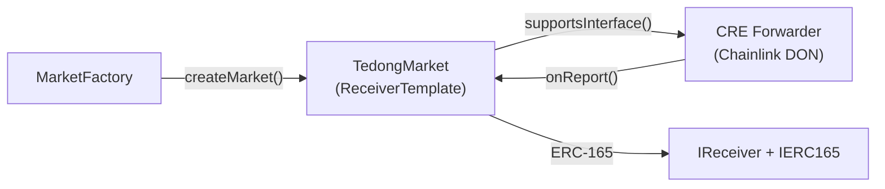
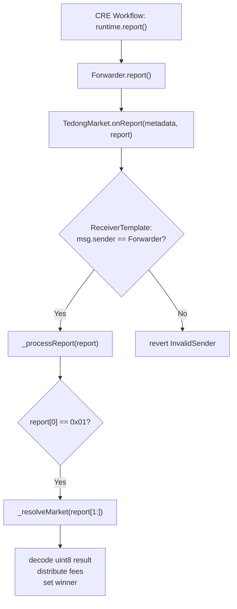

# Smart Contracts — Tedong Silaga

Solidity smart contracts for the Tedong Silaga decentralized prediction market. Built with Foundry, OpenZeppelin, and Chainlink CRE.

## Contracts

| Contract               | Description                                                            |
| ---------------------- | ---------------------------------------------------------------------- |
| `MarketFactory.sol`    | Factory that deploys a new `TedongMarket` for each match               |
| `TedongMarket.sol`     | Per-match contract: staking, locking, CRE resolution, fee distribution |
| `ReceiverTemplate.sol` | Base contract for receiving Chainlink CRE Forwarder reports (ERC-165)  |
| `IReceiver.sol`        | Interface for CRE Forwarder receiver — `onReport(metadata, report)`    |
| `MockUSDC.sol`         | Faucet-enabled mock USDC (6 decimals) for testnet                      |

---

## Architecture



### CRE Resolution Flow



---

## Contract Details

### interfaces/IReceiver.sol

Chainlink CRE Forwarder receiver interface. Extends ERC-165.

```solidity
interface IReceiver is IERC165 {
    function onReport(bytes calldata metadata, bytes calldata report) external;
}
```

| Item                  | Description                                                |
| --------------------- | ---------------------------------------------------------- |
| `onReport()`          | Entry point called by the CRE Forwarder with signed report |
| `supportsInterface()` | ERC-165 — returns `true` for `IReceiver` and `IERC165` IDs |

---

### interfaces/ReceiverTemplate.sol

Abstract base contract that implements `IReceiver`. Validates that only the trusted Chainlink Forwarder can call `onReport`.

#### Constructor

| Parameter           | Type      | Description                                                                 |
| ------------------- | --------- | --------------------------------------------------------------------------- |
| `_forwarderAddress` | `address` | Chainlink KeystoneForwarder contract (World Chain Sepolia: `0x6E9EE680...`) |

#### Functions

| Function                     | Access         | Description                                           |
| ---------------------------- | -------------- | ----------------------------------------------------- |
| `onReport(metadata, report)` | Forwarder only | Validates sender, then calls `_processReport(report)` |
| `getForwarderAddress()`      | Public (view)  | Returns the stored Forwarder address                  |
| `_processReport(report)`     | Internal       | Abstract — implemented by TedongMarket                |
| `supportsInterface(id)`      | Public (pure)  | ERC-165: returns `true` for IReceiver + IERC165       |

#### Errors

| Error                             | Trigger                                      |
| --------------------------------- | -------------------------------------------- |
| `InvalidForwarderAddress()`       | Constructor called with `address(0)`         |
| `InvalidSender(sender, expected)` | `onReport()` called by non-Forwarder address |

---

### MarketFactory.sol

Factory contract responsible for deploying a new `TedongMarket` for each buffalo fight match.

#### State Variables

| Variable             | Type        | Description                                        |
| -------------------- | ----------- | -------------------------------------------------- |
| `owner`              | `address`   | Factory owner, the only one who can create markets |
| `resolver`           | `address`   | CRE Forwarder address passed to each market        |
| `platformWallet`     | `address`   | Wallet receiving the platform fee (1%)             |
| `culturalFundWallet` | `address`   | Wallet receiving the cultural fund fee (1%)        |
| `token`              | `address`   | ERC-20 token address (MockUSDC)                    |
| `deployedMarkets`    | `address[]` | Array of all deployed market addresses             |

#### Functions

**`constructor(_resolver, _platformWallet, _culturalFundWallet, _token)`**

- Initializes the factory with the given configuration
- `owner` is automatically set to `msg.sender` (deployer)
- `_resolver` is the CRE Forwarder address — passed to each TedongMarket as the trusted Forwarder

**`createMarket(eventName, buffaloIdA, buffaloIdB, dataSourceUrl)` → `address`**

- **Access**: Owner only
- **Description**: Deploys a new `TedongMarket` contract via `new TedongMarket(cfg, info)`
- **Parameters**:
  - `eventName` — Match/event name (e.g., "pangkasong")
  - `buffaloIdA` — Buffalo A identifier (e.g., "iwan")
  - `buffaloIdB` — Buffalo B identifier (e.g., "lima tiga")
  - `dataSourceUrl` — URL of the result data source (Facebook link)
- **Returns**: Address of the newly deployed market contract
- **Event**: `MarketCreated(market, eventName, buffaloIdA, buffaloIdB, dataSourceUrl)`
- **Error**: `NotOwner()` if caller is not the owner

**`getDeployedMarkets()` → `address[]`**

- **Access**: Public (view)
- **Description**: Returns the array of all deployed market addresses

**`getMarketCount()` → `uint256`**

- **Access**: Public (view)
- **Description**: Returns the total number of created markets

---

### TedongMarket.sol

Per-match contract that handles staking, locking, AI-powered resolution via Chainlink CRE, and payout distribution. Inherits from `ReceiverTemplate` to accept signed reports from the CRE Forwarder.

#### Inheritance

```
ReceiverTemplate (← IReceiver ← IERC165)
  └── TedongMarket
```

#### Market Lifecycle

```
Open → Locked → Resolved
```

| Status     | Value | Description                                                 |
| ---------- | ----- | ----------------------------------------------------------- |
| `Open`     | 0     | Market is open, users can stake                             |
| `Locked`   | 1     | Match started, no more stakes. Emits `MarketLocked` for CRE |
| `Resolved` | 2     | Winner determined, users can claim winnings                 |

#### State Variables

| Variable             | Type                        | Description                      |
| -------------------- | --------------------------- | -------------------------------- |
| `admin`              | `address`                   | Factory deployer / market admin  |
| `platformWallet`     | `address`                   | Platform fee wallet (1%)         |
| `culturalFundWallet` | `address`                   | Cultural preservation fund (1%)  |
| `token`              | `IERC20`                    | ERC-20 token used for staking    |
| `eventName`          | `string`                    | Match name                       |
| `buffaloIdA`         | `string`                    | Buffalo A identifier             |
| `buffaloIdB`         | `string`                    | Buffalo B identifier             |
| `dataSourceUrl`      | `string`                    | Result data source URL           |
| `status`             | `Status`                    | Market status (0/1/2)            |
| `winner`             | `uint8`                     | Winner (1=A, 2=B, 3=Draw)        |
| `totalPoolA`         | `uint256`                   | Total staked on side A           |
| `totalPoolB`         | `uint256`                   | Total staked on side B           |
| `winningPool`        | `uint256`                   | Pool after fees deducted (98%)   |
| `stakesA`            | `mapping(address=>uint256)` | Per-user stake on side A         |
| `stakesB`            | `mapping(address=>uint256)` | Per-user stake on side B         |
| `claimed`            | `mapping(address=>bool)`    | Whether user has already claimed |

> **Note:** The Forwarder address is stored in `ReceiverTemplate` (accessed via `getForwarderAddress()`). The `resolver` field in the Config struct is passed to `ReceiverTemplate(_cfg.resolver)` at construction.

#### Constructor

```solidity
constructor(Config memory _cfg, Info memory _info) ReceiverTemplate(_cfg.resolver)
```

| Config Field         | Description                            |
| -------------------- | -------------------------------------- |
| `admin`              | Market admin (can lock the market)     |
| `resolver`           | CRE Forwarder address (trusted sender) |
| `platformWallet`     | Platform fee recipient                 |
| `culturalFundWallet` | Cultural fund recipient                |
| `token`              | ERC-20 staking token address           |

| Info Field      | Description                           |
| --------------- | ------------------------------------- |
| `eventName`     | Match/event name                      |
| `buffaloIdA`    | Buffalo A's name/identifier           |
| `buffaloIdB`    | Buffalo B's name/identifier           |
| `dataSourceUrl` | URL of community data (Facebook post) |

#### Functions

**`stake(choice, amount)`**

- **Access**: Public (anyone, while market is `Open`)
- **Description**: Stake tokens on Buffalo A or Buffalo B
- **Parameters**:
  - `choice` (`uint8`) — `1` for Buffalo A, `2` for Buffalo B
  - `amount` (`uint256`) — Token amount (in smallest unit, 6 decimals for USDC)
- **Mechanism**: Calls `token.safeTransferFrom()` — user must `approve()` first
- **Event**: `Staked(user, choice, amount)`
- **Errors**: `MarketNotOpen()`, `InvalidChoice()`, `ZeroAmount()`

**`lockMarket()`**

- **Access**: Admin only
- **Description**: Locks the market when the match starts; no more stakes allowed
- **Event**: `MarketLocked(market, dataSourceUrl)` — this event triggers the Chainlink CRE workflow via Log Trigger
- **Errors**: `NotAdmin()`, `MarketNotOpen()`

**`onReport(metadata, report)`** _(inherited from ReceiverTemplate)_

- **Access**: CRE Forwarder only
- **Description**: Entry point for CRE workflow reports. Validates the sender is the trusted Forwarder, then calls `_processReport(report)`
- **Error**: `InvalidSender(sender, expected)` if caller is not the Forwarder

**`_processReport(report)`** _(internal, overrides ReceiverTemplate)_

- **Description**: Routes the report based on prefix byte
- **Format**: `report[0] == 0x01` → calls `_resolveMarket(report[1:])`
- **Data**: `report[1:]` is `abi.encode(uint8 result)` where result is 1, 2, or 3

**`_resolveMarket(data)`** _(internal)_

- **Description**: Decodes the result, sets the winner, distributes fees
- **Fee Distribution**:
  - 1% of total pool → `platformWallet`
  - 1% of total pool → `culturalFundWallet`
  - Remaining 98% → `winningPool` (distributed to winners proportionally)
- **Events**: `FeesDistributed(platformFee, culturalFee)`, `MarketResolved(result)`
- **Errors**: `MarketNotLocked()`, `InvalidWinner()`

**`resolveMarket(result)`** _(legacy/testing)_

- **Access**: Forwarder address only (via `address(this)` check)
- **Description**: Direct resolution function kept for manual testing
- **Note**: In production, CRE uses `onReport()` → `_processReport()` path

**`claimWinnings()`**

- **Access**: Public (winning stakers)
- **Description**: Claim proportional winnings based on stake
- **Formula**: `payout = (winningPool × userStake) / winnerTotal`
- **Draw case (winner=3)**: All stakers receive proportional refund (minus 2% fees)
- **Event**: `WinningsClaimed(user, amount)`
- **Errors**: `MarketNotResolved()`, `AlreadyClaimed()`, `NothingToClaim()`

**`supportsInterface(interfaceId)` → `bool`** _(inherited from ReceiverTemplate)_

- **Access**: Public (pure)
- **Description**: ERC-165 interface detection. Returns `true` for `IReceiver` and `IERC165` interface IDs
- **Required by**: CRE Forwarder uses `supportsInterface()` to verify the contract can receive reports

**`getForwarderAddress()` → `address`** _(inherited from ReceiverTemplate)_

- **Access**: Public (view)
- **Description**: Returns the CRE Forwarder address configured at deployment

**`getTotalPool()` → `uint256`**

- **Access**: Public (view)
- **Description**: Returns total tokens across both pools (poolA + poolB)

**`getUserStake(user)` → `(uint256, uint256)`**

- **Access**: Public (view)
- **Description**: Returns the user's stake on side A and side B

#### Custom Errors

| Error                             | Trigger                                                    |
| --------------------------------- | ---------------------------------------------------------- |
| `NotAdmin()`                      | Non-admin calls `lockMarket()` or legacy `resolveMarket()` |
| `InvalidSender(sender, expected)` | `onReport()` called by non-Forwarder address               |
| `InvalidForwarderAddress()`       | Constructor called with `address(0)` as resolver           |
| `MarketNotOpen()`                 | `stake()` or `lockMarket()` called when market is not Open |
| `MarketNotLocked()`               | Resolution attempted when market is not Locked             |
| `MarketNotResolved()`             | `claimWinnings()` called when market is not Resolved       |
| `InvalidChoice()`                 | `stake()` called with choice other than 1 or 2             |
| `ZeroAmount()`                    | `stake()` called with amount 0                             |
| `AlreadyClaimed()`                | User calls `claimWinnings()` twice                         |
| `NothingToClaim()`                | Loser or non-staker calls `claimWinnings()`                |
| `InvalidWinner()`                 | Resolution called with result other than 1, 2, or 3        |

#### Events

| Event                               | When                                          |
| ----------------------------------- | --------------------------------------------- |
| `Staked(user, choice, amount)`      | User stakes tokens on a side                  |
| `MarketLocked(market, url)`         | Admin locks market → triggers CRE Log Trigger |
| `FeesDistributed(pFee, cFee)`       | Market resolved, fees sent to wallets         |
| `MarketResolved(winner)`            | Winner determined (1=A, 2=B, 3=Draw)          |
| `WinningsClaimed(user, amount)`     | User claims their proportional winnings       |
| `ForwarderAddressUpdated(old, new)` | Forwarder address set (from ReceiverTemplate) |

---

### MockUSDC.sol

ERC-20 faucet token for testnet. Decimals = 6 (same as real USDC).

| Function                | Access | Description                          |
| ----------------------- | ------ | ------------------------------------ |
| `faucet()`              | Public | Mint 1,000 USDC to caller            |
| `faucetTo(address)`     | Public | Mint 1,000 USDC to specified address |
| `faucetAmount(uint256)` | Public | Mint custom amount to caller         |

---

## Deployed Addresses (World Chain Sepolia)

| Contract      | Address                                                                                                                          | Verified |
| ------------- | -------------------------------------------------------------------------------------------------------------------------------- | -------- |
| MockUSDC      | [`0x6c4A665934214351e2886540a273Dc1A1dfAf775`](https://sepolia.worldscan.org/address/0x6c4A665934214351e2886540a273Dc1A1dfAf775) | Yes      |
| MarketFactory | [`0x49b4eec85810d31044dc7F06d1714Dcb93Cb96aA`](https://sepolia.worldscan.org/address/0x49b4eec85810d31044dc7F06d1714Dcb93Cb96aA) | Yes      |

| Role                     | Address                                      |
| ------------------------ | -------------------------------------------- |
| Deployer / Owner         | `0x7C1f9BcdEA7C160E4763d6da06399A7D363A9e22` |
| Resolver (CRE Forwarder) | `0x6E9EE680ef59ef64Aa8C7371279c27E496b5eDc1` |
| Platform Wallet          | `0x7C1f9BcdEA7C160E4763d6da06399A7D363A9e22` |
| Cultural Fund Wallet     | `0x7C1f9BcdEA7C160E4763d6da06399A7D363A9e22` |

### Deployed Markets

| Market Name    | Address                                                                                                                          | Buffalo A | Buffalo B | Data Source                                              |
| -------------- | -------------------------------------------------------------------------------------------------------------------------------- | --------- | --------- | -------------------------------------------------------- |
| **pangkasong** | [`0x7b4EDC62767aac5A2d258D1f7e289406200e6F35`](https://sepolia.worldscan.org/address/0x7b4EDC62767aac5A2d258D1f7e289406200e6F35) | iwan      | lima tiga | [Facebook](https://www.facebook.com/share/p/18Kdtwd3JR/) |

---

## Development

### Build

```bash
forge build
```

### Test

```bash
# Run all tests (18 tests across 4 suites)
forge test -vvv

# Run specific test
forge test --match-test test_FullFlow_BuffaloAWins -vvv
forge test --match-test test_SupportsInterface -vvv
forge test --match-test test_EndToEndFlow -vvv
```

### Deploy

```bash
# Step 1: Copy env and fill in values
cp .env.example .env

# Step 2: Deploy MockUSDC token
forge script script/DeployToken.s.sol:DeployToken --rpc-url $RPC_URL --broadcast --verify

# Step 3: Copy MockUSDC address to .env as TOKEN_ADDRESS

# Step 4: Deploy MarketFactory
forge script script/DeployMarket.s.sol:DeployMarket --rpc-url $RPC_URL --broadcast --verify

# Step 5: Copy MarketFactory address to .env as FACTORY_ADDRESS
```

### Create Market

Edit the match data in `script/CreateMarket.s.sol`, then run:

```bash
forge script script/CreateMarket.s.sol:CreateMarket --rpc-url $RPC_URL --broadcast
```

### Verify Market

To verify a TedongMarket contract that was deployed by the factory:

```bash
# Step 1: Generate constructor args from on-chain data
forge script script/VerifyMarket.s.sol:VerifyMarket \
  --rpc-url $RPC_URL \
  --sig "run(address)" \
  <MARKET_ADDRESS>

# Step 2: Copy the hex output, then run the verify command printed by the script
forge verify-contract \
  <MARKET_ADDRESS> \
  src/TedongMarket.sol:TedongMarket \
  --verifier-url 'https://api.etherscan.io/v2/api?chainid=4801' \
  --etherscan-api-key $ETHERSCAN_API_KEY \
  --constructor-args <HEX_FROM_STEP_1> \
  --watch
```

### Project Structure

```
SmartContracts-TedongSilaga/
├── src/
│   ├── TedongMarket.sol           # Per-match prediction market (inherits ReceiverTemplate)
│   ├── MarketFactory.sol          # Factory to deploy markets
│   ├── MockUSDC.sol               # Faucet token for testnet
│   └── interfaces/
│       ├── IReceiver.sol          # CRE Forwarder receiver interface (ERC-165)
│       └── ReceiverTemplate.sol   # Base contract: validates Forwarder + ERC-165
├── test/
│   ├── TedongMarket.t.sol         # 11 tests (full flow + CRE onReport + ERC-165)
│   ├── MarketFactory.t.sol        # 3 tests (factory flow + access control)
│   ├── Deploy.t.sol               # 4 tests (deployment simulation)
│   └── mocks/
│       └── MockERC20.sol          # Simple mock for unit tests
├── script/
│   ├── DeployToken.s.sol          # Deploy MockUSDC only
│   ├── DeployMarket.s.sol         # Deploy MarketFactory only
│   ├── CreateMarket.s.sol         # Create market via factory
│   └── VerifyMarket.s.sol         # Verify deployed market
├── .env.example                   # Required environment variables
└── foundry.toml                   # Foundry configuration
```
