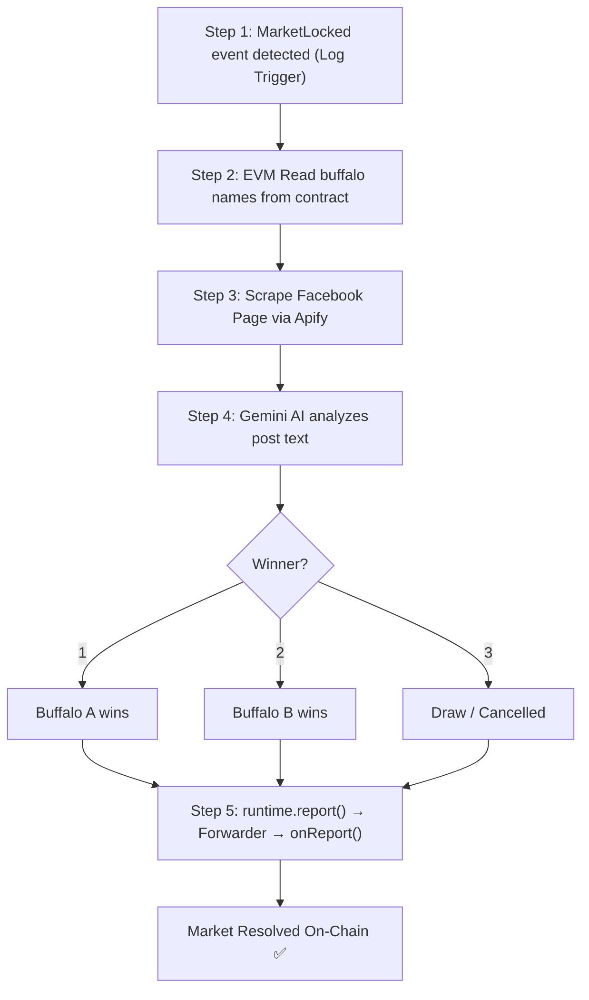

<div style="text-align:center" align="center">
    <a href="https://chain.link" target="_blank">
        
    </a>

[](https://github.com/smartcontractkit/cre-templates/blob/main/LICENSE)
[](https://chain.link/chainlink-runtime-environment)
[](https://docs.chain.link/cre)

</div>

# Tedong Silaga — CRE Workflow

Chainlink CRE workflow that automates on-chain settlement of the Tedong Silaga prediction market. Detects `MarketLocked` events on World Chain, scrapes real Facebook posts via Apify, determines the winner using Google Gemini AI, and writes the result on-chain through the CRE Forwarder.

## Key Features

| Feature                    | Description                                                                        |
| -------------------------- | ---------------------------------------------------------------------------------- |
| **EVM Log Trigger**        | Automatically listens for `MarketLocked(address, string)` event on World Chain     |
| **EVM Read**               | Reads buffalo names and event data from the `TedongMarket` contract                |
| **Facebook Scraping**      | Retrieves real community posts from a Facebook Page via [Apify](https://apify.com) |
| **AI-Powered Judgment**    | Google Gemini analyzes post content to determine the winner (1, 2, or 3)           |
| **EVM Write (CRE Report)** | Settles the market on-chain via `onReport()` + CRE Forwarder pattern (ERC-165)     |

## Workflow Flow



## Project Structure

```
tedong-workflow/
├── my-workflow/
│   ├── main.ts              # Workflow entry: trigger, EVM read/write, orchestration
│   ├── facebook.ts          # Apify integration: scrape Facebook Page posts
│   ├── gemini.ts            # Gemini AI integration: analyze post → determine winner
│   ├── config.staging.json  # Staging config (World Chain Sepolia)
│   ├── config.production.json
│   └── workflow.yaml        # CRE workflow settings
├── contracts/
│   └── abi/
│       ├── TedongMarket.ts  # Full ABI (onReport, stake, lockMarket, etc.)
│       └── index.ts         # Re-export
├── project.yaml             # CRE project config + RPC endpoints
├── secrets.yaml             # Secret names (GEMINI_API_KEY, APIFY_TOKEN)
└── .env                     # Secret values (DO NOT COMMIT)
```

## Configuration

### config.staging.json

```json
{
  "geminiModel": "gemini-3-flash-preview",
  "chainSelectorName": "ethereum-testnet-sepolia-worldchain-1",
  "marketAddress": "0x49b4eec85810d31044dc7F06d1714Dcb93Cb96aA",
  "gasLimit": "500000",
  "facebookPageId": "61586373132016",
  "apifyActorId": "udA8UidvXIKpN2yNS"
}
```

| Field               | Description                                       |
| ------------------- | ------------------------------------------------- |
| `geminiModel`       | Gemini model name (must support `thinkingConfig`) |
| `chainSelectorName` | CRE chain identifier for World Chain              |
| `marketAddress`     | MarketFactory contract address                    |
| `gasLimit`          | Gas limit for on-chain write                      |
| `facebookPageId`    | Facebook Page numeric ID to scrape                |
| `apifyActorId`      | Apify actor ID for Facebook page scraper          |

### Secrets (.env)

```env
CRE_ETH_PRIVATE_KEY=0x...        # Resolver wallet private key
GEMINI_API_KEY_VAR=AIza...        # Google Gemini API key
APIFY_TOKEN_VAR=apify_api_...     # Apify API token
```

## Quick Start

### 1. Install Dependencies

```bash
bun install --cwd ./my-workflow
```

### 2. Configure Secrets

Copy and fill `.env`:

```bash
cp .env.example .env
# Set CRE_ETH_PRIVATE_KEY, GEMINI_API_KEY_VAR, APIFY_TOKEN_VAR
```

### 3. Post Result on Facebook

Post on the configured Facebook Page with buffalo names as keywords:

```
📢 Hasil Tedong Silaga: championfallo vs bentok
Pertandingan hari ini di acara silagaArena.
Pemenang: championfallo menang telak setelah 15 menit!
#TedongSilaga #AduKerbau
```

### 4. Lock the Market On-Chain

```bash
# Via Foundry (or via frontend)
cast send $MARKET_ADDRESS "lockMarket()" --rpc-url $RPC_URL --private-key $PRIVATE_KEY
```

### 5. Simulate

```bash
cre workflow simulate my-workflow --broadcast
```

Expected output:

```
[Step 1] MarketLocked event detected
[Step 2] Buffalo A: championfallo, Buffalo B: bentok
[Step 3] Found 3 Facebook posts
[Step 4] AI Result: 1 (championfallo)
[Step 5] Settlement successful: 0x...
=== Resolution Complete ===
```

### 6. Deploy to CRE DON

```bash
cre workflow deploy my-workflow
```

## External Services

| Service                                      | Purpose                | Free Tier           |
| -------------------------------------------- | ---------------------- | ------------------- |
| [Apify](https://apify.com)                   | Facebook Page scraper  | $5/month credit     |
| [Google Gemini](https://aistudio.google.com) | AI buffalo fight judge | Free tier available |
| [Alchemy](https://alchemy.com)               | World Chain RPC        | Free tier available |

## Related

- **[Smart Contracts README](../../SmartContracts-TedongSilaga/README.md)** — Full contract documentation
- **[Product Requirements Document](../../PRD.md)** — PRD
