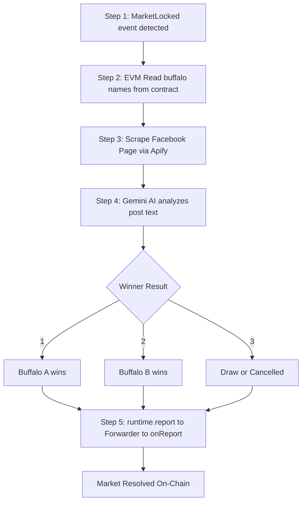

<div style="text-align:center" align="center">
    <a href="https://chain.link" target="_blank">
        
    </a>

[](https://github.com/smartcontractkit/cre-templates/blob/main/LICENSE)
[](https://chain.link/chainlink-runtime-environment)
[](https://docs.chain.link/cre)

</div>

# Tedong Silaga CRE Workflow

Chainlink CRE workflow that automates on-chain settlement of the Tedong Silaga prediction market. Detects MarketLocked events on World Chain, scrapes real Facebook posts via Apify, determines the winner using Google Gemini AI, and writes the result on-chain through the CRE Forwarder.

## Key Features

| Feature           | Description                                                              |
| ----------------- | ------------------------------------------------------------------------ |
| EVM Log Trigger   | Automatically listens for MarketLocked event on World Chain              |
| EVM Read          | Reads buffalo names and event data from the TedongMarket contract        |
| Facebook Scraping | Retrieves real community posts from a Facebook Page via Apify            |
| AI Judgment       | Google Gemini analyzes post content to determine the winner (1, 2, or 3) |
| EVM Write         | Settles the market on-chain via onReport and CRE Forwarder pattern       |
| API Server        | Local API server handling frontend requests to trigger CRE workflow      |

## Workflow Flow



## Project Structure

| File / Folder                      | Purpose                                                    |
| ---------------------------------- | ---------------------------------------------------------- |
| my-workflow/main.ts                | Workflow logic (trigger, EVM read/write, orchestration)    |
| my-workflow/facebook.ts            | Apify integration to scrape Facebook Page posts            |
| my-workflow/gemini.ts              | Gemini AI integration to analyze post and determine winner |
| my-workflow/config.staging.json    | Staging environment configuration                          |
| my-workflow/config.production.json | Production environment configuration                       |
| my-workflow/workflow.yaml          | CRE workflow settings                                      |
| contracts/abi/                     | Contract ABIs including TedongMarket                       |
| project.yaml                       | CRE project configuration and RPC endpoints                |
| secrets.yaml                       | Secret variable declarations                               |
| .env                               | Environment variables                                      |
| server.ts                          | Bun API server to seamlessly trigger the workflow          |

## Configuration

### config.staging.json

```json
{
  "geminiModel": "gemini-3-flash-preview",
  "chainSelectorName": "ethereum-testnet-sepolia-worldchain-1",
  "marketAddress": "0x49b4eec85810d31044dc7F06d1714Dcb93Cb96aA",
  "gasLimit": "500000",
  "facebookPageId": "61586373132016",
  "apifyActorId": "udA8UidvXIKpN2yNS"
}
```

| Field             | Description                              |
| ----------------- | ---------------------------------------- |
| geminiModel       | Gemini model name                        |
| chainSelectorName | CRE chain identifier for World Chain     |
| marketAddress     | MarketFactory contract address           |
| gasLimit          | Gas limit for on-chain write             |
| facebookPageId    | Facebook Page numeric ID to scrape       |
| apifyActorId      | Apify actor ID for Facebook page scraper |

### Secrets Configuration

```env
CRE_ETH_PRIVATE_KEY=0x...
GEMINI_API_KEY_VAR=AIza...
APIFY_TOKEN_VAR=apify_api_...
```

## Guide to Running the Workflow API Server

To make it simple and perfectly aligned with the frontend structure, you only need to run the bundled server to process resolutions.

### 1. Install Dependencies

```bash
bun install --cwd ./my-workflow
```

### 2. Configure Environment Variables

Create and populate the `.env` file:

```bash
cp .env.example .env
```

Ensure you have set valid values for `CRE_ETH_PRIVATE_KEY`, `GEMINI_API_KEY_VAR`, and `APIFY_TOKEN_VAR`.

### 3. Start the API Server

Run the `server.ts` file. This starts a local API on port `8081` which the frontend uses to request market resolution via CRE.

```bash
bun run server.ts
```

### 4. Trigger Market Resolution

If testing manually (without the frontend), mock a facebook post for the event:

```text
Hasil Tedong Silaga: buffalo_A vs buffalo_B
Pemenang: buffalo_A menang telak setelah 15 menit!
#TedongSilaga
```

Then simulate the frontend trigger using curl:

```bash
curl -X POST http://localhost:8081/api/resolve \
  -H "Content-Type: application/json" \
  -d '{"marketAddress":"0x...","tx_locked_hash":"0x..."}'
```

Expected output in the server console:

```text
[Step 1] MarketLocked event detected
[Step 2] Buffalo A: buffalo_A, Buffalo B: buffalo_B
[Step 3] Found 3 Facebook posts
[Step 4] AI Result: 1 (buffalo_A)
[Step 5] Settlement successful: 0x...
=== Resolution Complete ===
```

## Chainlink Architecture Integration

The Tedong Silaga protocol heavily relies on Chainlink CRE to bridge off-chain events with on-chain settlement. Here are the core files composing this integration:

| Component Level      | File Name                                                                                                                  | Description                                                                                                                                                       |
| -------------------- | -------------------------------------------------------------------------------------------------------------------------- | ----------------------------------------------------------------------------------------------------------------------------------------------------------------- |
| **Frontend Trigger** | [`../../fe-tedong-silaga/app/api/action/resolve/route.ts`](../../fe-tedong-silaga/app/api/action/resolve/route.ts)         | Triggers the CRE server API to execute this workflow simulation process when the jury clicks "Resolve".                                                           |
| **CRE API Server**   | [`server.ts`](./server.ts)                                                                                                 | Express-like Bun server acting as the bridge between the frontend and the CRE CLI.                                                                                |
| **CRE Workflow**     | [`my-workflow/main.ts`](./my-workflow/main.ts)                                                                             | The core CRE typescript logic. Detects events, queries contracts (EVM Read), calls Apify & Gemini, and reports the consensus back to the chain (EVM Write).       |
| **CRE Scripts**      | [`my-workflow/facebook.ts`](./my-workflow/facebook.ts)                                                                     | Logic inside the workflow to securely fetch data via the Apify external adapter.                                                                                  |
| **CRE Scripts**      | [`my-workflow/gemini.ts`](./my-workflow/gemini.ts)                                                                         | AI judging logic using Gemini to deterministically process facebook posts into an integer (`1`, `2`, or `3`).                                                     |
| **Smart Contract**   | [`../../SmartContracts-TedongSilaga/src/ReceiverTemplate.sol`](../../SmartContracts-TedongSilaga/src/ReceiverTemplate.sol) | Abstract ERC-165 contract validating that calls come from the designated Chainlink CRE Forwarder address.                                                         |
| **Smart Contract**   | [`../../SmartContracts-TedongSilaga/src/TedongMarket.sol`](../../SmartContracts-TedongSilaga/src/TedongMarket.sol)         | Inherits ReceiverTemplate. Implements the hidden `_processReport` logic which ONLY the Chainlink CRE network can trigger via `onReport()` to settle market funds. |

## External Services

| Service       | Purpose                |
| ------------- | ---------------------- |
| Apify         | Facebook Page scraper  |
| Google Gemini | AI buffalo fight judge |
| Alchemy       | World Chain RPC        |

## Related Resources

| Document | Link |
|---|---|
| Main Documentation | [../../README.md](../../README.md) |
| Frontend Interface | [../../fe-tedong-silaga/README.md](../../fe-tedong-silaga/README.md) |
| Smart Contracts | [../../SmartContracts-TedongSilaga/README.md](../../SmartContracts-TedongSilaga/README.md) |
